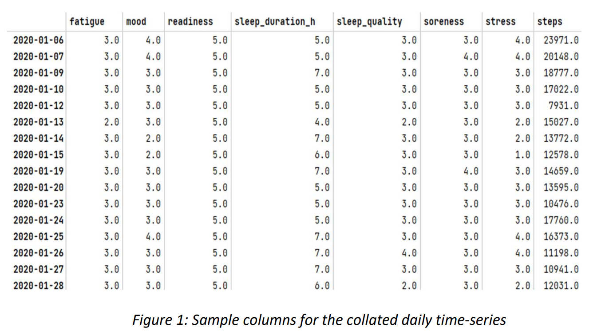
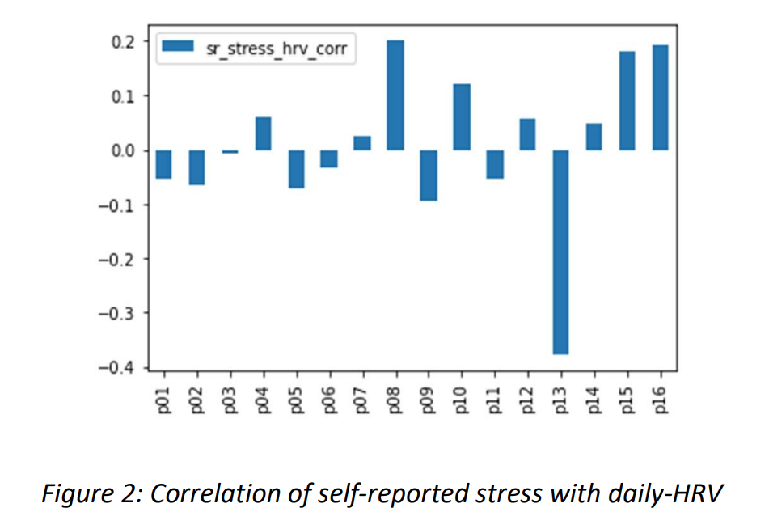
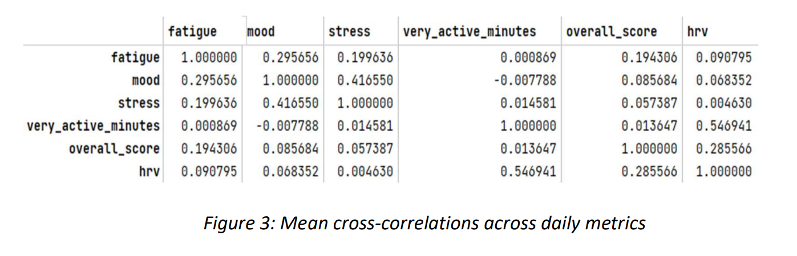
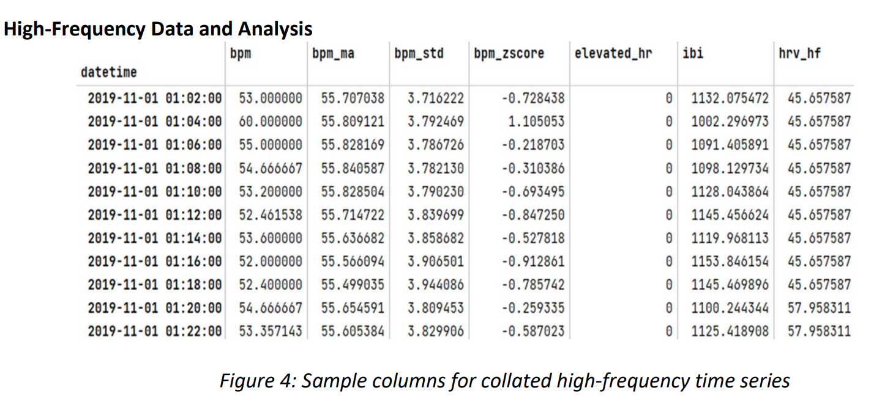
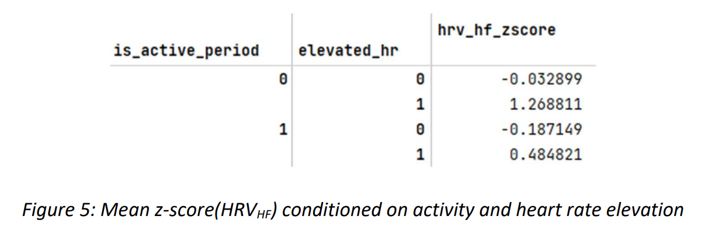
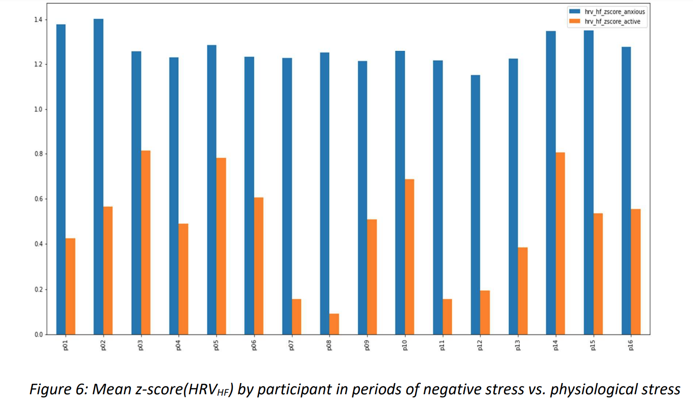
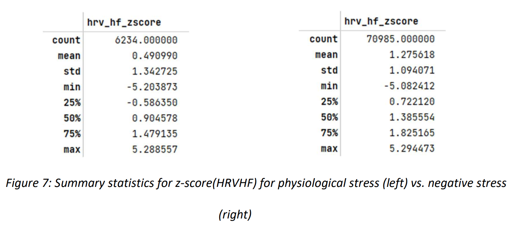

# A Novel Method for Real-Time Detection of Negative Stress for High School Students

Ashwin Ranjan  
The Dalton School  
New York  
November 25th, 2022

## Abstract

This study explores the use of biometric markers captured by wearable devices to detect negative stress in high school students. As this data was hard to collect due to various privacy and legal concerns, this paper utilizes a public dataset consisting of FitBit data and self-reported qualitative data for 16 individuals over a three month period. Initially, heart rate variability (HRV) was chosen as the metric to detect stress. The analysis found no discernible correlation between self-reported stress and HRV or other metrics like fatigue, mood, stress, etc., when studied on a daily basis. This confirmed the observation that it is difficult to identify "good stress" vs. "bad stress". However, a novel higher frequency metric (HRVHF) proposed in this study shows a difference in the body's biometric response between periods of negative stress vs. physiological stress or "good" stress. During periods of inactivity, an elevated heart rate is accompanied by HRVHF z-scores > 1 and is defined as negative stress. Conversely, during periods of physical activity, and elevated heart rate, HRVHF z-scores are < 0.5 and are defined as "good" stress. Welch's t-test was then performed on the two score segments (physiological stress in active periods and negative stress during inactive periods), to obtain a p-value < 0.001, thereby disproving the null hypothesis that z score is invariant across stress associated with physical activity and negative stress. This gives a predictable metric that can be used to detect the onset of negative stress in real-time and provide notifications in the form of nudges.

## Real-time detection of stress related to negative stress

Any intrinsic or extrinsic stimulus that evokes a biological response is known as stress. The compensatory responses to these stresses are known as stress responses. Based on the type, timing and severity of the applied stimulus, stress can exert various actions on the body ranging from alterations in homeostasis to life-threatening effects and death. More specific effects on the cognitive systems, cardio-vascular system, gastro-intestinal system, and immune system due to negative stress are well understood (Vrijkotte et. al. 2000; Yaribeygi et. al. 2017). How to identify in real time and then alleviate stress to avoid these outcomes remains an area of research.

Wearable technology has enabled real-time collection of biometric data without the need for expensive laboratory or medical equipment. Several studies are now available to study stress using data collected using fitness trackers such as the Oura Ring, or Google FitBit (Silva et. al. 2020). As these devices become more ubiquitous, there is considerable interest in using the generated data to nudges users towards healthier life choices.

The search for stress biomarkers captured by wearable devices remains a challenging task due to a lack of consensus on the definition of stress as well as a comprehensive framework for investigating how human beings function in and adapt to constantly changing environments. At present, there is no universally recognized standard for stress evaluation, but studies on heart rate variability (HRV) as a high-correlation indicator of stress are increasing in frequency (Task Force of the European Society of Cardiology and the North American Society of Pacing and Electrophysiology. 1996; Kang et. al. 2004; Kim et. al. 2018).

## Materials and Methods

Due to limitations on collecting biometric data from students, the open dataset "PMData" (Vajira et. al. 2020), publicly available under a Creative Commons Attribution 4.0 International (CC BY 4.0) License[^1] was used in this study. PMData contains logging data of 16 participants (ages 26 through 60) from a period between Jan 12th, 2019 through December 3rd, 2020. There are 2,440 activity sessions (manual and 15-min-auto reports), 20,991,392 heart rate measurements, and 1,836 days of sleep scores included. Data from the Fitbit Versa 2 smartwatch has been extracted into CSV and JSON files, and contains the following files:

- calories.json shows calories burned per minute.
- distance.json gives distance moved per minute (centimeters).
- exercise.json describes each activity in more detail (date with start and stop time, time in different activity levels, type of activity and various performance metrics)
- heart_rate.json shows the number of heart beats per minute (bpm) at a given time.
- sedentary_minutes.json sums up the sedentary minutes per day.
- lightly_active_minutes.json sums up the lightly active minutes per day.
- moderately_active_minutes.json sums up the moderately active minutes per day.
- very_active_minutes.json sums up the very active minutes per day.
- resting_heart_rate.json gives the resting heart rate per day.
- sleep_score.csv contains an overall 0-100 score made up of composition, revitalization and duration scores, number of deep sleep minutes, resting heart rate and a restlessness score.
- sleep.json is the breakdown of the sleep into periods of light, deep, REM, and time awake.
- steps.json displays the number of steps per minute.
- time_in_heart_rate_zones.json gives the number of minutes in different heart rate zones[^2].

In addition to the FitBit data, there is self-reported data for 783 training sessions, 1,747 wellness reports, and 225 injury reports, via the following files:

- srpe.csv contains a exercise training session's end-time, type, perceived exertion, and duration.
- wellness.csv includes parameters like time and date, fatigue, mood, readiness, sleep duration (number of hours), sleep quality, soreness (and soreness area), and perceived stress.
- injury.csv shows injuries with a time and date, location, and a minor or major severity.

## Data and Analysis

The data was not collected using a standardized time frequency. To overcome this, the data was imported from each file for each participant, and leveraging the time stamp to collate the data, low-frequency (daily) and high-frequency (2-min) data frames were created.

### Daily-Frequency Data and Analysis

Next the HRV was computed from the heart rate data (bpm) data available, using the following transformations (Kim et. al. 2018) to obtain inter-beat-interval (IBI) in microseconds:

$IBI = \frac{60,000}{bpm}$

IBI was resampled and then time averaged using 5-minute time intervals and the standard-deviation was computed over daily time-periods:

$HRV_{daily} = \sigma_{daily}(\mu_{5-min}(IBI))$

Surprisingly, there was almost no correlation with the gold-standard daily-HRV measure and self-reported stress from the study participants.

Furthermore, besides mood, there was no discernible correlation of daily-HRV for any of the daily metrics[^3] tested.

The conclusion was that there wasn't a daily-frequency observable metric that could predict "perceived stress". Participants seem to perceive and report stress somewhat correlated to their mood during the day.

### High-Frequency Data and Analysis

Next, the heart rate variability was examined. Given heart rate (BPM) data is available on average every 9 seconds, there about 13 IBI observations available every 2 minutes. To account for this, the high-frequency HRV measure was reformulated as shown below:

$HRV_{HF} = \sigma_{20-min}(\mu_{2-min}(IBI))$

Both measures BPM (heart rate), and HRVHF (high-frequency heart rate variability) were then resampled and collated on a 2-minute time-step. To eliminate base effects, time-series data was normalized using a z-score metric, over a rolling 1-hour window. For a time-series X(ti), and window of n periods:

$\mu(X)(t_i) = \frac{1}{n} \sum_{s=i-n}^{i} (X(t_s))$

$\sigma(X)(t_i) = \sqrt{\frac{1}{n} \sum_{s=i-n}^{i} (X(t_s) - \mu (X)(t_s))^2}$

$z\text{-}score(X)(t_i) = \frac{(X(t_i) - \mu(X)(t_i))}{\sigma(X)(t_i)}$

Time stamps where metric z-scores exceeded 2, were labeled using 1-0 encoding as "elevated". For example, z-score(BPM) > 2, suggests an elevated heart rate.

Exercise data was then converted from intervals to a time-series and collated with heart rate data to identify "active periods", when a participant was engaged in a physical activity (e.g. walking, running, etc.) and thought of as "good" stress.

### Stress associated with negative Stress

It is well understood that negative stress sets off the body's "fight or flight" response as part of the autonomic nervous system (ANS) (Goldstein 2010). Furthermore, negative stress is often associated with heart palpitations, fluttering and irregular heartbeat. In extreme cases, some of the classic symptoms of a panic attack, a racing heart coupled with feeling breathless and dizzy, overlap with a condition known as supraventricular tachycardia, or SVT. This condition occurs when faulty electrical signals in the heart override the heart's normal pacemaker, triggering a series of fast heartbeats. During a bout of SVT, the heart rate can soar as high as 250 beats or more per minute. (A normal heart rate is between 60 and 100). Based on this, I reasoned that:

A) A period where a participant is not physically active, but experiencing an elevated heart rate (as indicated by a z-score(BPM) > 2), suggests that the participant is possibly experiencing negative stress. This high-frequency HRV measure should be elevated during periods of stress associated with this state as suggested by the available literature.

B) A period where a participant is physically active, and experiencing an elevated heart rate (as indicated by a z-score(BPM) > 2), suggests that the participant is possibly physiologically stressed which we call "good stress". This high-frequency HRV measure should be depressed during periods of stress associated with activity as suggested by the available literature on physiological stress.

**Null hypothesis:** H0: z-score(HRVHF) is invariant across stress associated with physical activity and negative stress.

## Results

There is a marked difference in z-scores for high-frequency HRV during period of negative stress (elevated heart rate during inactive periods) vs. periods of physiological stress (elevated heart rate during physical activity) for all participants.

This difference in mean presents itself cross-sectionally as well. While there is variance across participants in active z-score(HRVHF), presumably due to varying fitness levels, found the negative stress z-score(HRVHF) values are a lot more clustered.

Welch's t-test was then performed on the two score segments (physiological stress in active periods and negative stress during inactive periods), to obtain a p-value < 0.001, thereby disproving the null hypothesis.

## Discussion and Conclusions

This study explores various biometric and self-reported markers to see if they can be used to help alleviate (in real-time) the latent and salient negative stress experienced by high-school students these days.

The analysis showed there was no discernible correlation between self-reported stress and daily HRV measures computed using biometric data. It also found little correlation between other metrics like fatigue, mood, stress, overall sleep scores, when studied on a daily basis. In and of itself, this is a discouraging outcome as a majority of statistics that are provided by current consumer grade wearables seem to be of limited use in battling negative stress. In a way, this is consistent with the observation that there isn't a lot of literature that deals with "good stress" vs. "bad stress".

However, the exploration of higher frequency data, mostly related to heart rate variability, led to a very interesting observation. A high-frequency HRV (standard-deviation over 20-minute intervals of 2-minute IBI-means), when normalized using a z-score, are starkly different between periods of negative stress vs. physiological stress. During periods of elevated heart rates when the participant is inactive, HRVHF z-scores at well north of 1. Conversely, during periods of elevated heart rates when the participant is physically active, HRVHF z-scores are < 0.5. This gives researchers in the field a clear metric to detect onset of negative stress in real-time and provide notifications in the forms of nudges, in a non-medical setting.

Given how hard it is to gather data on high school students due to privacy and legal constraints, this is a very promising result. For now, we'll utilize the concept of transfer learning from machine learning literature to posit that our conclusions, derived from data on adult populations, will transfer to teenage populations as well. Further work is needed to:

- Expand the participant population (cross-section), hopefully get primary data on high-school students
- Develop and train more advanced statistical learning models such as convolutional neural networks (Zhu et. al. 2022; Li et. al 2015)
- Develop nudges and interventions to understand if this negative stress can be reduced or managed in real time

## References

# References

Goldstein D. S. (2010). Adrenal responses to stress. Cellular and molecular neurobiology, 30(8), 1433-1440. https://doi.org/10.1007/s10571-010-9606-9

Kang, M. G., Koh, S. B., Cha, B. S., Park, J. K., Woo, J. M., & Chang, S. J. (2004). Association between job stress on heart rate variability and metabolic syndrome in shipyard male workers. Yonsei medical journal, 45(5), 838-846. https://doi.org/10.3349/ymj.2004.45.5.838

Kim, H. G., Cheon, E. J., Bai, D. S., Lee, Y. H., & Koo, B. H. (2018). Stress and Heart Rate Variability: A Meta-Analysis and Review of the Literature. Psychiatry investigation, 15(3), 235-245. https://doi.org/10.30773/pi.2017.08.17

Li, X., Hu, B., Shen, J., Xu, T., & Retcliffe, M. (2015). Mild Depression Detection of College Students: an EEG-Based Solution with Free Viewing Tasks. Journal of medical systems, 39(12), 187. https://doi.org/10.1007/s10916-015-0345-9

Silva, E., Aguiar, J., Reis, L.P, Sá, J.O., Gonçalves, J., & Carvalho, V. (2020) Stress among Portuguese Medical Students: the EuStress Solution. Journal of Medical Systems 44, 45. https://doi.org/10.1007/s10916-019-1520-1

Task Force of the European Society of Cardiology and the North American Society of Pacing and Electrophysiology. (1996). Heart rate variability: standards of measurement, physiological interpretation and clinical use. Circulation, 93(5), 1043-1065. https://doi.org/10.1161/01.CIR.93.5.1043

Thambawita, V., Hicks, S.A., Borgli, H., Stensland, H.K., Jha, D., Svensen, M.K., Pettersen, S.A., Johansen, D., Johansen, H.D., Pettersen, S.D., Nordvang, S., Pedersen, S., Gjerdrum, A., Grønli, T.M., Fredriksen, P.M., Eg, R., Hansen, K., Fagernes, S., Claudi, C., Biørn-Hansen, A., Nguyen, D.T, Kupka, T, Hammer, H.L., Jain, R., Riegler, M.A., and Halvorsen, P (2020). PMData: a sports logging dataset. Proceedings of the 11th ACM Multimedia Systems Conference, 231-236. https://doi.org/10.1145/3339825.3394926

Vrijkotte, T. G., van Doornen, L. J., & de Geus, E. J. (2000). Effects of work stress on ambulatory blood pressure, heart rate, and heart rate variability. Hypertension (Dallas, Tex. : 1979), 35(4), 880-886. https://doi.org/10.1161/01.hyp.35.4.880

Yaribeygi, H., Panahi, Y., Sahraei, H., Johnston, T. P., & Sahebkar, A. (2017). The impact of stress on body function: A review. EXCLI journal, 16, 1057-1072. https://doi.org/10.17179/excli2017-480

Zhu, J., Jiang, C., Chen, J., Lin, X., Yu, R., Li, X., & Hu, B. (2022). EEG based depression recognition using improved graph convolutional neural network. Computers in biology and medicine, 148, 105815. https://doi.org/10.1016/j.compbiomed.2022.105815

[^1]: Before collection, each participant signed a form allowing the authors to collect and publish the data related to this project.
[^2]: Using the common formula of 220 minus your age to find the max heartrate, Fitbit will calculate your maximum heart rate and then create three target heart rate zones—fat burn (50 to 69 percent of your max heart rate), cardio (70 to 84 percent of your max heart rate), and peak (85 to 100 percent of your max heart rate).
[^3]: overall_score is the composite sleep score for the day
